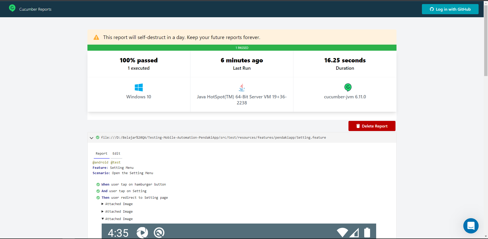
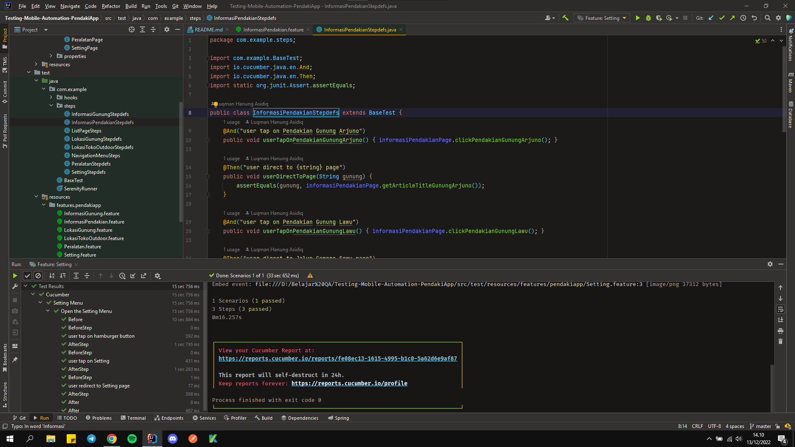
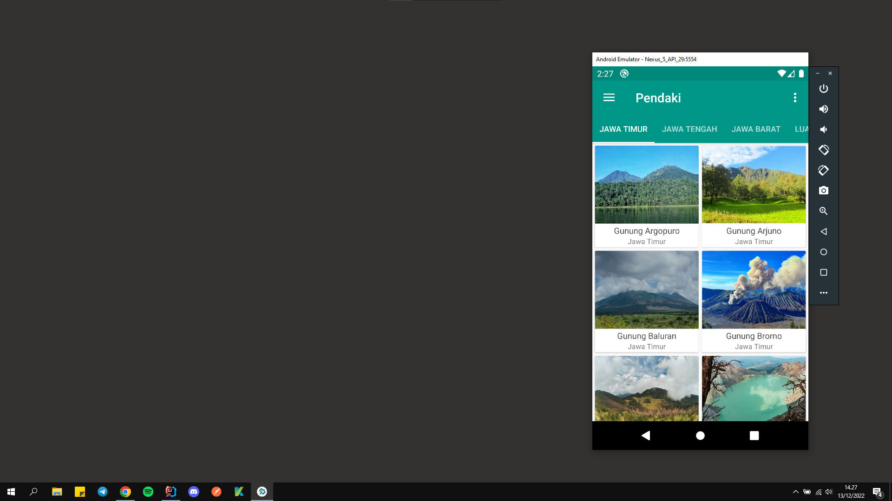

<div align="center">
  <a href="https://github.com/Luqmanhanung/Testing-Mobile-Automation-PendakiApp.git">
    
  </a>
</div>

## 📑 About the Project

<p align="justify">Pendaki App is a mobile-based application that is used to make it easier for mountain climbers to obtain information about mountains in Indonesia. The available information includes details on the origin of the mountain, available hiking trails, equipment and tips on mountain climbing and so on.</p>

## 📓 Testing Documentation
[Test Case Documentation](https://docs.google.com/spreadsheets/d/1ppP_ZsrwpjdTcSQ9Xh6qMabsgxsvdwNe/edit?usp=sharing&ouid=106261304285108213478&rtpof=true&sd=true)

## 📝 Reports

#### Report


#### Automation Testing When Run in Intellij IDE and Emulator Android Studio



## 🛠 Tools
**Manual:**


**Automation:**  


## 🏎️ How to Run all Test Scenarios

1. Clone the repository
```bash
  $ git clone https://github.com/Luqmanhanung/Testing-Mobile-Automation-PendakiApp.git
```
2. Open  this Project Repository on Intellij IDE and Run one of test case 


## 📱 Project By

[](https://www.linkedin.com/in/luqman-hanung-asidiq/)
[](https://github.com/Luqmanhanung/)

<h5>
<p align="center">:copyright: 2022 | This Repository Built with :heart: by <a href="https://www.linkedin.com/in/luqman-hanung-asidiq/"> Luqmanhanung</a></p>
</h5>
